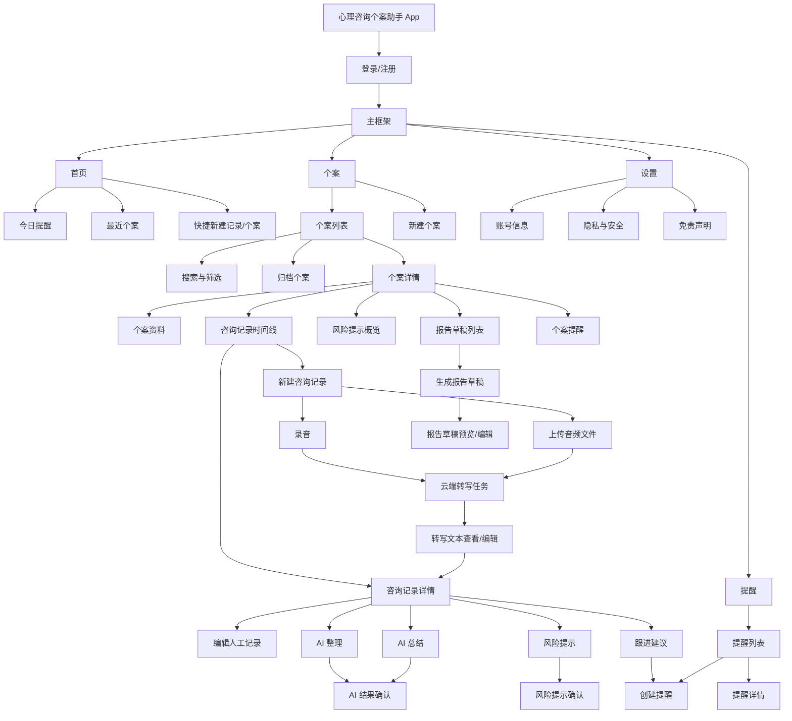
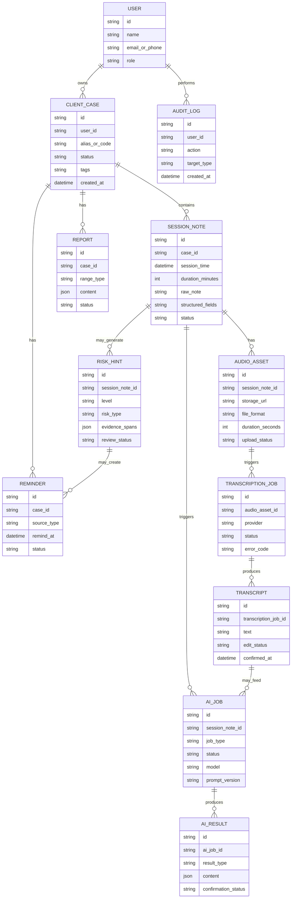

# 心理咨询个案助手 App 信息架构图

## 1. 信息架构目标

本文定义 MVP 阶段的 App 页面结构、导航入口、核心功能分布和主要数据对象关系。目标是帮助产品、设计、客户端和后端在进入 Flutter 页面实现与工程设计前形成一致理解。

## 2. MVP 导航结构

MVP 建议采用底部 Tab + 详情页栈的移动端结构。

底部 Tab：

- 首页
- 个案
- 提醒
- 设置

报告、AI 结果、风险提示作为个案详情和咨询记录详情下的二级能力，不单独放底部 Tab，避免 MVP 导航过重。



## 3. 页面与功能矩阵

| 一级模块 | 页面 | 核心功能 | MVP 优先级 |
| --- | --- | --- | --- |
| 登录 | 登录页 | 账号登录、登录态恢复 | P0 |
| 首页 | 首页 | 今日提醒、最近个案、快捷入口 | P0 |
| 个案 | 个案列表 | 搜索、筛选、查看活跃/归档个案 | P0 |
| 个案 | 新建/编辑个案 | 填写基础资料、标签、备注 | P0 |
| 个案 | 个案详情 | 资料、记录、风险、报告、提醒聚合 | P0 |
| 录音转写 | 录音页 | 录制、暂停、继续、结束、保存音频 | P0 |
| 录音转写 | 上传音频页 | 选择本地音频、上传、失败重试 | P0 |
| 录音转写 | 转写任务页 | 上传进度、转写状态、失败原因、重试 | P0 |
| 咨询记录 | 新建/编辑记录 | 转写文本、手动文本、结构化字段、草稿 | P0 |
| 咨询记录 | 记录详情 | 查看音频、转写、人工记录、AI 输出、风险提示 | P0 |
| AI 辅助 | AI 结果确认页 | 查看、编辑、确认、重新生成 | P0 |
| 风险提示 | 风险提示确认页 | 查看等级、证据、确认/误报/创建提醒 | P0 |
| 报告 | 报告草稿页 | 选择范围、生成草稿、编辑、复制/导出 | P1 |
| 提醒 | 提醒列表 | 待处理、已完成、过期提醒 | P0 |
| 设置 | 设置页 | 账号、隐私、免责声明 | P1 |

## 4. 核心对象关系



## 5. 内容组织规则

### 5.1 首页

首页不承载复杂管理能力，只提供高频入口：

- 今日待跟进提醒。
- 最近访问个案。
- 快捷新建咨询记录，可直接进入录音或上传音频。
- 最近 AI 任务状态。

### 5.2 个案详情

个案详情是 MVP 的核心工作台，应聚合以下信息：

- 个案基础资料。
- 咨询记录时间线，包括音频、转写和人工记录状态。
- 最新风险状态。
- 报告草稿入口。
- 关联提醒。

### 5.3 咨询记录详情

咨询记录详情应清晰区分三类内容：

- 原始音频和云端转写文本。
- 咨询师人工输入或编辑内容。
- AI 生成草稿内容。
- 人工确认后的正式内容。

### 5.4 风险提示

风险提示不作为普通摘要的一部分隐藏展示，应有单独区域，突出：

- 风险等级。
- 风险类型。
- 证据片段。
- 不确定性说明。
- 咨询师处理动作。

## 6. Flutter 页面与组件样例建议

弃用 Figma 后，建议第一版直接在 Flutter 中通过静态页面、组件样例页或 design gallery 覆盖以下页面与状态：

1. 登录页。
2. 首页。
3. 个案列表。
4. 个案详情。
5. 新建个案。
6. 新建咨询记录入口。
7. 录音页。
8. 上传音频页。
9. 转写任务处理中/失败/成功状态。
10. 转写文本查看与编辑。
11. 咨询记录详情。
12. AI 结果生成中。
13. AI 结果确认。
14. 风险提示确认。
15. 报告草稿。
16. 提醒列表。
17. 设置/隐私说明。

建议优先沉淀的 flutter_easy_ui 业务组件：

- 录音控制按钮组：未开始、录音中、暂停、上传中。
- 转写状态卡：待上传、上传中、转写中、成功、失败。
- 风险等级标签：无明显风险、低风险、中风险、高风险、紧急关注。
- AI 结果确认卡：待确认、已确认、已编辑、已放弃。
- 咨询记录卡片：音频、转写、AI 摘要、风险提示状态。
- 免责声明弹窗：录音授权、AI 辅助、风险提示。

## 7. Flutter 路由建议

```text
/login
/home
/cases
/cases/new
/cases/:caseId
/cases/:caseId/edit
/cases/:caseId/sessions/new
/cases/:caseId/sessions/:sessionId/audio/record
/cases/:caseId/sessions/:sessionId/audio/upload
/cases/:caseId/sessions/:sessionId/transcriptions/:transcriptionJobId
/cases/:caseId/sessions/:sessionId
/cases/:caseId/sessions/:sessionId/ai-results/:resultId/confirm
/cases/:caseId/sessions/:sessionId/risk-hints/:riskHintId/confirm
/cases/:caseId/reports/new
/cases/:caseId/reports/:reportId
/reminders
/reminders/new
/reminders/:reminderId
/settings
/settings/privacy
/settings/disclaimer
```

## 8. MVP 边界

纳入 MVP：

- 单咨询师账号视角。
- 个人个案管理。
- App 内录音、上传已录制音频文件。
- 云端 API 异步转写。
- 基于转写文本和人工编辑文本的咨询记录。
- AI 整理、摘要、风险提示、跟进建议。
- 报告草稿。
- App 内提醒。

不纳入 MVP：

- 机构组织架构。
- 多咨询师协作。
- 督导审批。
- 会中实时字幕式转写。
- 复杂权限矩阵。
- Web 后台。
