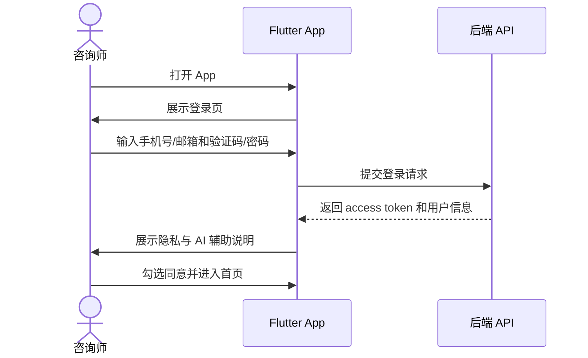
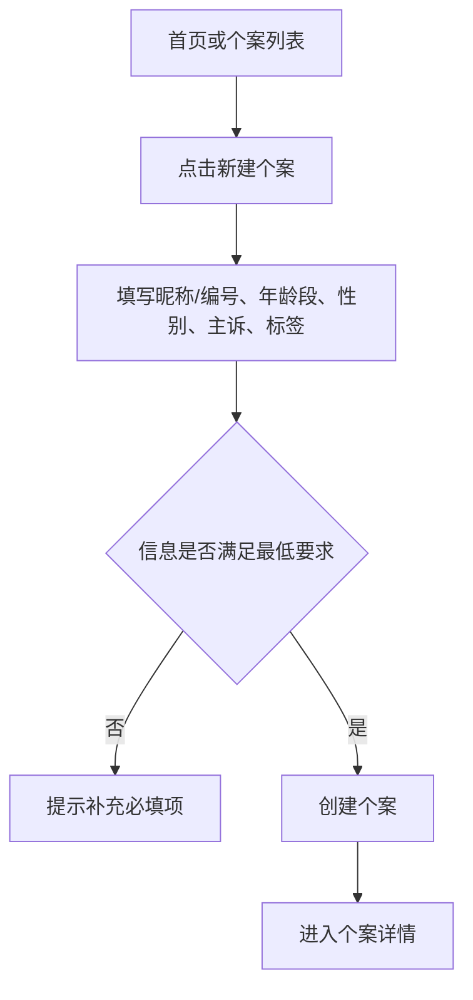
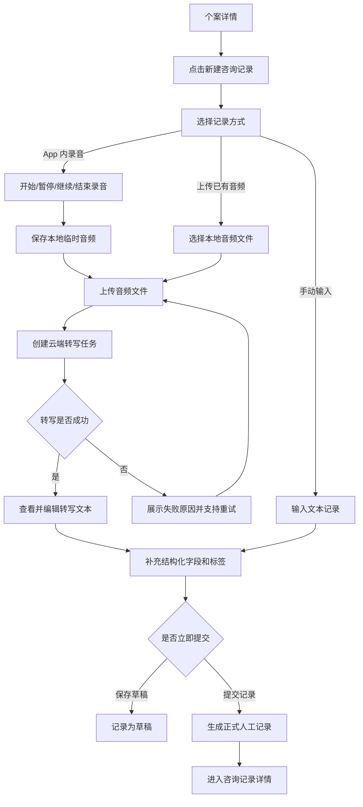
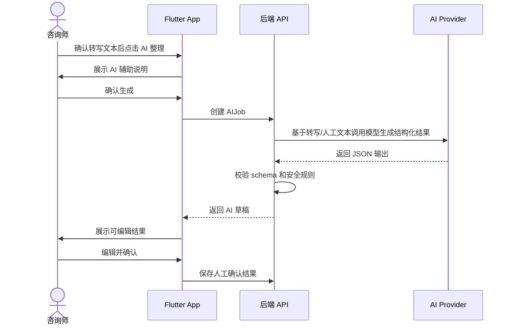
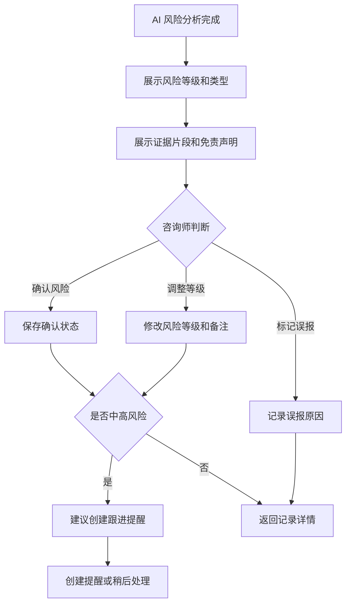
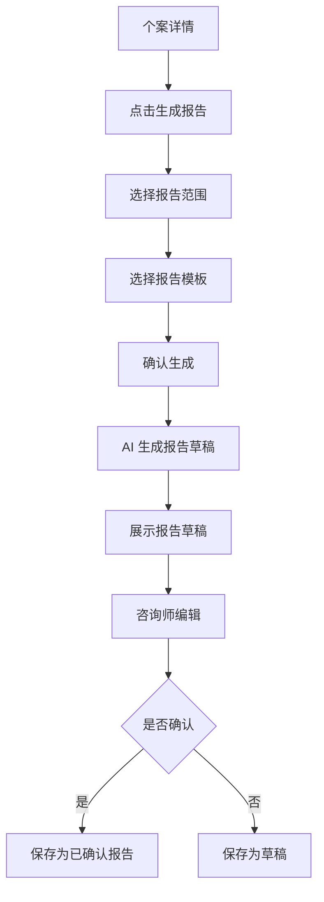
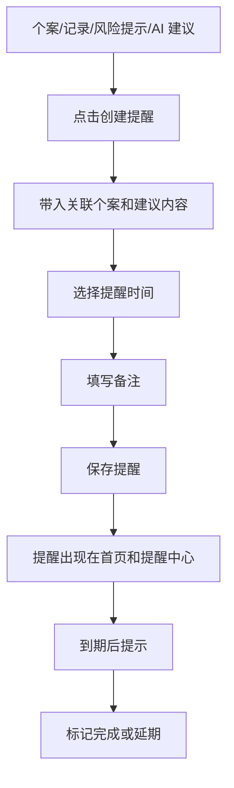
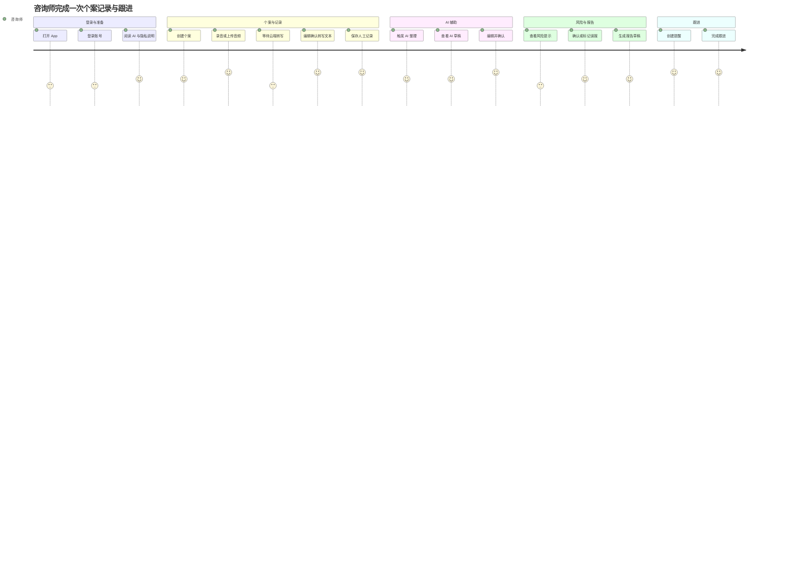

# 心理咨询个案助手 App 核心用户旅程

## 1. 用户旅程目标

本文描述 MVP 阶段咨询师在 App 中完成核心闭环的路径，包括关键页面、用户动作、系统反馈、AI 介入点、异常分支和验收关注点。

MVP 核心闭环：

```text
登录 -> 创建个案 -> 录音/上传音频 -> 云端转写 -> 编辑确认文本 -> AI 整理/总结 -> 风险提示确认 -> 生成报告草稿 -> 创建跟进提醒
```

## 2. 主要角色

| 角色 | 目标 | 关注点 |
| --- | --- | --- |
| 咨询师 | 高效记录、整理、回顾和跟进个案 | 快速、准确、隐私安全、可编辑 |
| 试点运营人员 | 观察 MVP 是否有效提升效率 | 完整闭环、可用率、反馈收集 |
| 系统 | 提供记录、AI 辅助、风险提示、提醒能力 | 稳定、可追溯、安全合规 |

## 3. 旅程一：首次使用与登录

### 3.1 目标

咨询师完成登录，理解产品的 AI 辅助边界和隐私提示。

### 3.2 流程



### 3.3 关键触点

- 登录页：强调数据安全和专业辅助定位。
- 首次进入说明：AI 不是诊断工具，输出需人工确认。
- 设置页：可再次查看隐私说明和免责声明。

### 3.4 异常分支

| 异常 | 系统处理 |
| --- | --- |
| 登录失败 | 展示明确错误，不暴露账号是否存在等敏感判断 |
| token 过期 | 引导重新登录 |
| 未同意隐私说明 | 不进入主界面 |

## 4. 旅程二：创建个案

### 4.1 目标

咨询师用最少必要信息创建个案，避免强制收集真实身份信息。

### 4.2 流程



### 4.3 关键字段

P0 必填：

- 昵称或个案编号。
- 初始主诉或备注，二选一。

P0 可选：

- 年龄段。
- 性别。
- 标签。
- 咨询目标。

### 4.4 体验要求

- 不强制填写真实姓名、身份证、联系方式等高敏感信息。
- 个案创建后立即可新建咨询记录。
- 个案详情显示“暂无咨询记录”的空状态和新建入口。

## 5. 旅程三：录音、上传与云端转写

### 5.1 目标

咨询师在 App 内录制咨询音频，或上传已录制好的音频文件，由云端 API 转写为可编辑文本，再形成咨询记录。

### 5.2 流程



### 5.3 用户动作

- 开始、暂停、继续、结束或放弃录音。
- 上传已经录制好的音频文件。
- 等待云端转写完成。
- 查看并编辑转写文本。
- 填写本次主题、情绪状态、干预方式、下次计划。
- 保存草稿或提交记录。

### 5.4 系统反馈

- 录音前展示授权/知情同意提示。
- 录音中展示时长、录音状态和保存状态。
- 上传中展示进度，失败时支持重试。
- 转写中展示任务状态，允许用户离开页面后回来查看。
- 自动保存转写文本和草稿。
- 转写文本和人工文本均为空时禁用 AI 生成入口。
- 提交成功后展示 AI 整理入口。

### 5.5 异常分支

| 异常 | 系统处理 |
| --- | --- |
| 录音中断 | 尽量保留本地临时音频，提示恢复、保存或放弃 |
| App 切后台 | 按系统能力继续录音或提示录音已暂停 |
| 上传失败 | 保留本地音频，支持重试或改为手动输入 |
| 转写失败 | 展示失败原因，支持重试或手动补录文本 |
| 网络中断 | 本地保存音频和草稿，恢复后提示同步 |
| 音频过长 | 提示可能需要较长转写时间，后端分段处理 |
| 文本过长 | 提示可能需要较长 AI 处理时间，后端分段处理 |
| 离开页面 | 自动保存并提示草稿状态 |

## 6. 旅程四：AI 整理与总结

### 6.1 目标

咨询师从转写文本或人工文本生成结构化摘要和跟进建议，并保留人工编辑权。

### 6.2 流程



### 6.3 AI 输出内容

- 结构化记录。
- 本次摘要。
- 来访者变化。
- 干预方式整理。
- 跟进建议。

### 6.4 关键体验

- 生成中状态必须明确，可离开页面后回来查看结果。
- AI 输出默认显示“待确认”。
- 咨询师可以编辑、重新生成、放弃结果。
- 确认后才进入正式记录或报告候选内容。

### 6.5 异常分支

| 异常 | 系统处理 |
| --- | --- |
| AI 生成失败 | 展示失败原因和重试入口 |
| JSON schema 校验失败 | 自动重试一次，仍失败则展示“无法生成” |
| 输出为空或质量差 | 支持重新生成和反馈 |
| 用户不确认 | 结果保留为草稿，不进入正式报告 |

## 7. 旅程五：风险提示确认

### 7.1 目标

系统提示潜在风险线索，咨询师进行专业判断并决定处理动作。

### 7.2 流程



### 7.3 咨询师可选动作

- 确认风险。
- 调整风险等级。
- 标记误报。
- 添加专业备注。
- 创建跟进提醒。
- 暂不处理但保留提示。

### 7.4 系统要求

- 风险提示必须展示为“辅助提示”。
- 风险提示必须展示证据片段。
- 高风险和紧急关注必须出现更醒目的处理建议。
- 未确认风险不得进入正式报告。

## 8. 旅程六：生成报告草稿

### 8.1 目标

咨询师基于一段时间内的咨询记录快速生成报告草稿。

### 8.2 流程



### 8.3 报告内容

- 个案基本信息。
- 咨询范围和次数。
- 主要问题和变化。
- 干预方式。
- 风险关注。
- 后续建议。

### 8.4 异常分支

| 异常 | 系统处理 |
| --- | --- |
| 所选范围无记录 | 禁止生成并提示调整范围 |
| 存在未确认风险 | 提示先确认风险，或仅作为待审核内容 |
| 生成失败 | 支持重试 |

## 9. 旅程七：创建跟进提醒

### 9.1 目标

咨询师从个案、咨询记录、风险提示或 AI 建议创建提醒。

### 9.2 流程



### 9.3 体验要求

- 从风险提示创建提醒时，自动带入风险等级，但提醒通知不展示敏感详情。
- 过期提醒在首页和提醒中心突出显示。
- 已完成提醒保留历史记录。

## 10. 端到端主流程验收



## 11. 关键度量点

| 节点 | 指标 | 目标 |
| --- | --- | --- |
| 创建个案 | 完成率 | >= 90% |
| 新建记录 | 单次记录耗时 | <= 3 分钟完成初稿 |
| AI 整理 | 生成成功率 | >= 95% schema 合法 |
| AI 结果 | 人工采纳率 | >= 70% 可用或稍改可用 |
| 风险提示 | 人工处理率 | 100% 有确认、调整或误报状态 |
| 提醒 | 到期处理率 | 试点阶段观察，不设硬指标 |

## 12. 旅程边界

MVP 不覆盖以下旅程：

- 咨询师之间转介个案。
- 督导审阅记录。
- 来访者端登录。
- 自动发送消息给来访者。
- 会中实时字幕式转写。
- 自动报警或自动危机干预。
