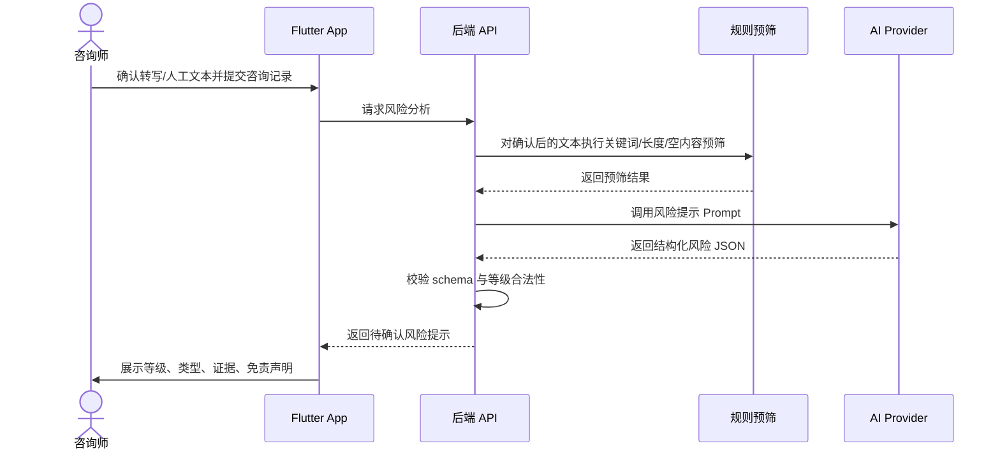
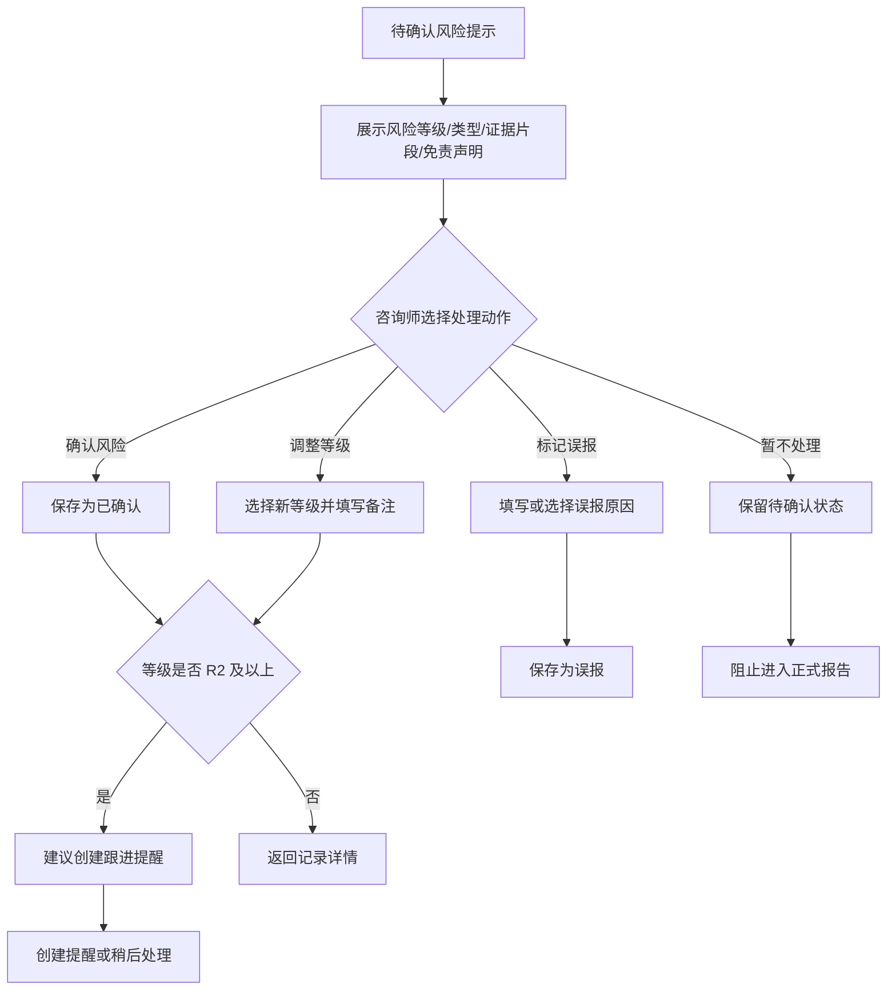
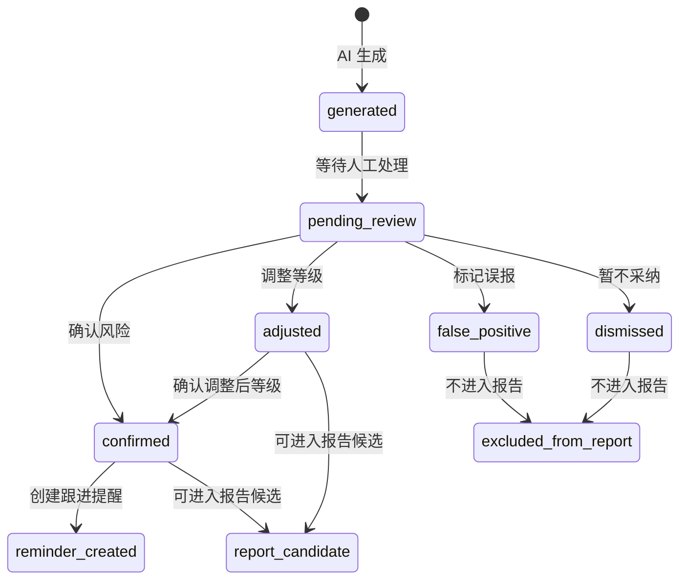

# 风险提示免责声明与人工确认流程

## 1. 文档目标

本文定义心理咨询个案助手 App MVP 阶段的风险提示定位、免责声明文案、风险等级、人工确认流程、状态机、页面要求和验收标准。

核心原则：

- 风险提示是辅助提醒，不是诊断结论。
- 风险提示必须展示触发依据和不确定性。
- 风险提示必须由咨询师人工确认、调整或标记误报。
- 未确认风险提示不得进入正式报告。

## 2. 风险提示产品定位

### 2.1 是什么

风险提示用于帮助咨询师关注咨询记录中可能存在的风险线索，例如：

- 自伤或自杀相关表达。
- 伤害他人相关表达。
- 被虐待、被控制或严重安全威胁。
- 明显情绪危机或功能受损。
- 需要及时跟进的异常变化。

MVP 中风险提示主要基于云端转写文本和咨询师人工编辑后的记录文本生成。由于录音质量、说话人重叠、口音、环境噪声和转写 API 能力限制，转写文本可能存在遗漏或错误，因此风险提示也可能出现漏报或误报。

### 2.2 不是什么

风险提示不是：

- 心理诊断。
- 精神医学诊断。
- 危机干预指令。
- 法律意见。
- 替代咨询师专业判断的自动决策。
- 自动报警或自动联系第三方的依据。

## 3. 免责声明文案

### 3.1 首次使用通用文案

建议在首次进入 App、首次触发 AI 风险分析、设置页中展示：

```text
本产品提供的 AI 整理、总结和风险提示仅用于辅助心理咨询师进行个案记录和工作回顾，不构成心理诊断、医学诊断、危机干预建议或法律意见。所有 AI 输出均可能存在遗漏、误判或不完整，必须由具备相应资质和专业能力的咨询师结合实际情况进行判断、编辑和确认。
```

若启用录音转写，建议追加：

```text
录音转写结果可能受录音质量、环境噪声、说话人重叠等因素影响而存在错误或遗漏。请在使用 AI 整理、总结和风险提示前，先检查并必要时修正转写文本。
```

### 3.2 风险提示卡片短文案

用于风险提示卡片顶部：

```text
AI 辅助提示，仅供专业参考。请结合来访者实际情况进行人工判断。
```

### 3.3 中高风险提示文案

用于中风险、高风险、紧急关注：

```text
该提示不代表诊断结论。若你判断存在现实安全风险，请按照你的专业伦理、机构规范和当地适用流程及时处理，并优先保障相关人员安全。
```

### 3.4 报告草稿中的风险说明

用于报告草稿中涉及风险内容的区域：

```text
以下风险关注内容基于咨询记录和 AI 辅助整理生成，已由咨询师人工审核后纳入报告。该内容仅作为个案工作记录的一部分，不构成独立诊断结论。
```

### 3.5 未确认风险的提示文案

用于报告生成前拦截：

```text
当前存在尚未人工确认的风险提示。请先确认、调整或标记误报后，再将相关内容纳入报告。
```

## 4. 风险等级定义

| 等级 | 名称 | 定义 | UI 建议 | 默认动作 |
| --- | --- | --- | --- | --- |
| R0 | 无明显风险 | 未发现明确风险线索 | 中性灰/绿色 | 不强制处理 |
| R1 | 低风险 | 存在轻微信号，但缺少明确计划、意图或紧迫性 | 浅黄 | 可记录观察 |
| R2 | 中风险 | 存在较明确风险线索，需要咨询师关注和后续跟进 | 橙色 | 建议创建提醒 |
| R3 | 高风险 | 存在明确表达、计划、近期行为或安全威胁线索 | 红色 | 强提示确认和跟进 |
| R4 | 紧急关注 | 记录中出现可能需要立即处理的安全风险线索 | 深红/警示样式 | 强提示按专业流程处理 |

## 5. 风险类型

| 类型 | 示例线索 | 说明 |
| --- | --- | --- |
| self_harm_or_suicide | 自伤、自杀、活不下去、计划结束生命 | 需展示证据片段，避免扩大解释 |
| harm_to_others | 想伤害他人、报复、暴力计划 | 需关注对象、计划、可及性 |
| abuse_or_neglect | 家暴、虐待、被控制、被威胁 | 需关注安全环境和保护资源 |
| severe_crisis | 极端绝望、失控、严重功能受损 | 不等于诊断，只提示危机线索 |
| substance_or_impulse | 物质滥用、冲动行为、失控行为 | MVP 可作为辅助类型 |
| other | 其他需要关注的风险 | 需要 AI 给出说明和证据 |

## 6. 风险提示生成流程



## 7. 人工确认流程

### 7.1 主流程



### 7.2 必须提供的处理动作

| 动作 | 说明 | 是否必需 |
| --- | --- | --- |
| 确认风险 | 咨询师认可该提示基本成立 | 是 |
| 调整等级 | 咨询师认为等级偏高或偏低 | 是 |
| 标记误报 | 咨询师认为该提示不成立 | 是 |
| 添加备注 | 记录专业判断依据 | 建议 |
| 创建提醒 | 为后续跟进创建任务 | R2 及以上建议 |
| 稍后处理 | 保留待确认状态 | 允许，但限制报告使用 |

## 8. 风险提示状态机



## 9. 页面展示要求

### 9.1 风险提示卡片

必须展示：

- 风险等级。
- 风险类型。
- 简短说明。
- 证据片段。
- AI 辅助免责声明。
- 状态：待确认、已确认、已调整、误报、暂不采纳。

建议展示：

- 生成时间。
- 使用模型或“AI 生成”标识。
- prompt/schema 版本可在调试或详情中展示，不必面向普通用户。

### 9.2 风险提示确认页

必须包含：

- 完整风险说明。
- 原始证据片段，可跳转到咨询记录上下文。
- 等级调整控件。
- 备注输入框。
- 操作按钮：确认、调整后确认、标记误报、稍后处理。
- R2 及以上的创建提醒入口。

### 9.3 报告生成拦截

当存在 `pending_review` 风险提示时：

- 报告生成页应提示“存在未确认风险提示”。
- 默认不将该风险写入正式报告。
- 可允许生成草稿，但需标注“待审核内容”，具体是否允许由后续产品决策确认。

## 10. 风险提示结构化输出建议

AI 输出 JSON 建议结构：

```json
{
  "risk_level": "R2",
  "risk_types": ["self_harm_or_suicide"],
  "summary": "记录中出现需要进一步评估的自伤相关表达。",
  "evidence_spans": [
    {
      "quote": "原文片段",
      "start_offset": 120,
      "end_offset": 138,
      "reason": "该片段包含自伤相关表达"
    }
  ],
  "uncertainty": "上下文不足，需咨询师结合实际情况判断。",
  "suggested_actions": [
    "进一步评估现实风险",
    "安排跟进提醒"
  ]
}
```

## 11. 后端字段建议

| 字段 | 类型 | 说明 |
| --- | --- | --- |
| id | string | 风险提示 ID |
| session_note_id | string | 关联咨询记录 |
| transcript_id | string | 关联转写文本，可为空 |
| ai_job_id | string | 关联 AI 任务 |
| risk_level | enum | R0-R4 |
| risk_types | string[] | 风险类型 |
| summary | string | 风险说明 |
| evidence_spans | json | 证据片段 |
| uncertainty | string | 不确定性说明 |
| suggested_actions | json | 建议动作 |
| review_status | enum | pending_review/confirmed/adjusted/false_positive/dismissed |
| reviewed_level | enum | 人工调整后的等级 |
| reviewer_note | string | 咨询师备注 |
| reviewed_at | datetime | 人工处理时间 |
| created_at | datetime | 生成时间 |

## 12. 审计要求

以下动作需要写入审计日志：

- 生成风险提示。
- 查看风险提示详情。
- 确认风险。
- 调整风险等级。
- 标记误报。
- 创建风险相关提醒。
- 将风险内容纳入报告。

审计日志不得包含完整咨询原文和证据片段，只记录对象 ID、动作、时间、用户 ID。

## 13. 验收标准

- [ ] 风险提示卡片包含免责声明。
- [ ] 风险提示展示证据片段。
- [ ] 咨询师可以确认、调整等级、标记误报。
- [ ] R2 及以上提示有创建跟进提醒入口。
- [ ] 未确认风险提示不能默认进入正式报告。
- [ ] 所有风险处理动作有审计记录。
- [ ] 风险提示状态可追溯。
- [ ] 风险提示文案不使用“诊断为”“判定为”等绝对化表达。
- [ ] 基于转写文本生成风险提示前，用户有机会查看并编辑转写文本。
- [ ] 风险提示说明中包含转写可能错误或遗漏的提醒。

## 14. 禁用表达清单

产品文案、AI 输出和报告中应避免以下表达：

- “系统诊断为……”
- “AI 判定来访者存在……”
- “确认存在自杀风险”
- “必须立即采取……”
- “本结论准确无误”
- “可替代专业评估”

建议替代表达：

- “记录中出现可能需要关注的线索……”
- “AI 辅助提示：请结合实际情况判断。”
- “建议咨询师进一步评估……”
- “该提示可能存在误判或遗漏。”
- “请按专业伦理、机构规范和当地适用流程处理。”
